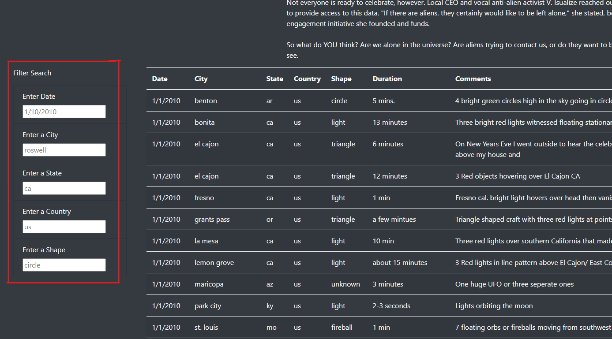
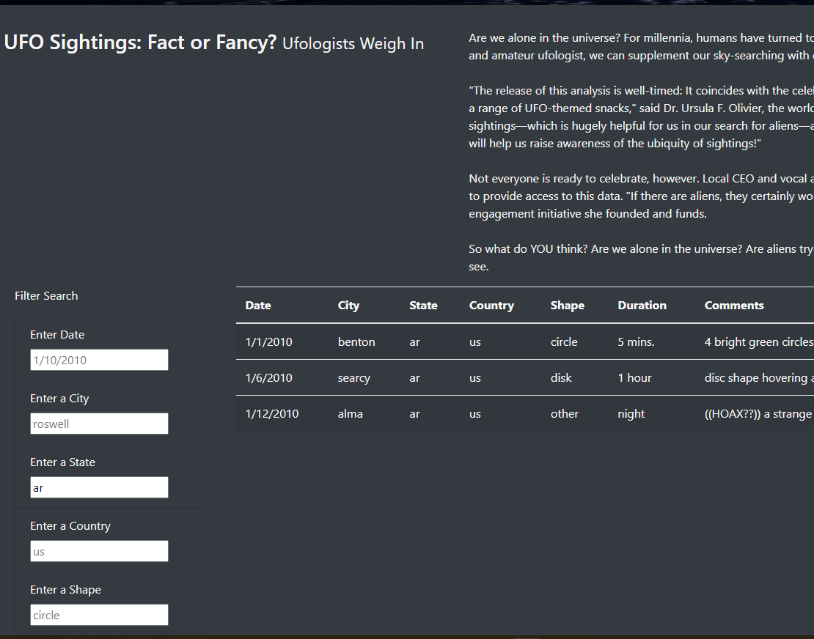
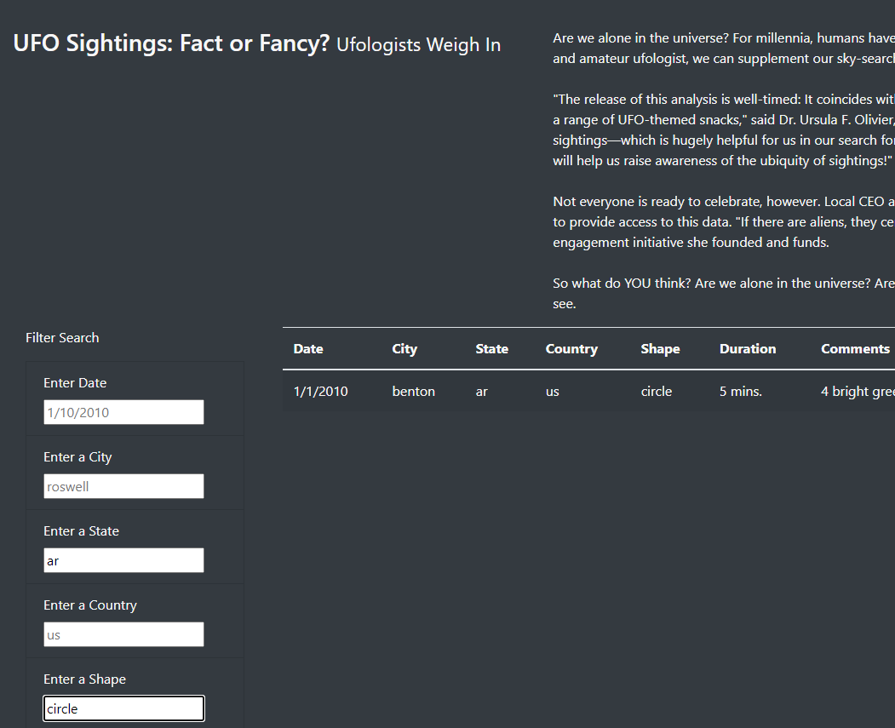

# UFOs
## Overview of Project:
This analysis help Dana to learn more about UFO sightings.

## Results:
Users can enter filter search boxs to filte the data.

For example, entering "Enter a State" filter search box with ar and press enter on your keybord, webpage will find all UFO sightings that happend in Arkansas state.

Also users are allow to enter multiple filter search boxs and get more specific data.

For example, this user want find the UFO sighting not only happend in Arkansas but also the UFO looks like a circle.

In that case, user can easily enter "Enter a State" with ar and "Enter a Shape" with circle to get the data.

## Summary:
The drawback of this webpage is users need to enter the word with right form in the search box like "ca" or "ar", if user enter "California" or "Arkansas" the webpage will be malfunction.

My recommendation for further development is switch the input box to other tool.

First, change "Enter a City","Enter a State","Enter a Country","Enter a Shape" with drop-down list to make sure users will enter the right form.

Second, change "Enter Date" with calendar tool, like vanilla-js-calendar, this calendar tool not only make user choose date easier but also make sure web page 
won't receive wrong date form.